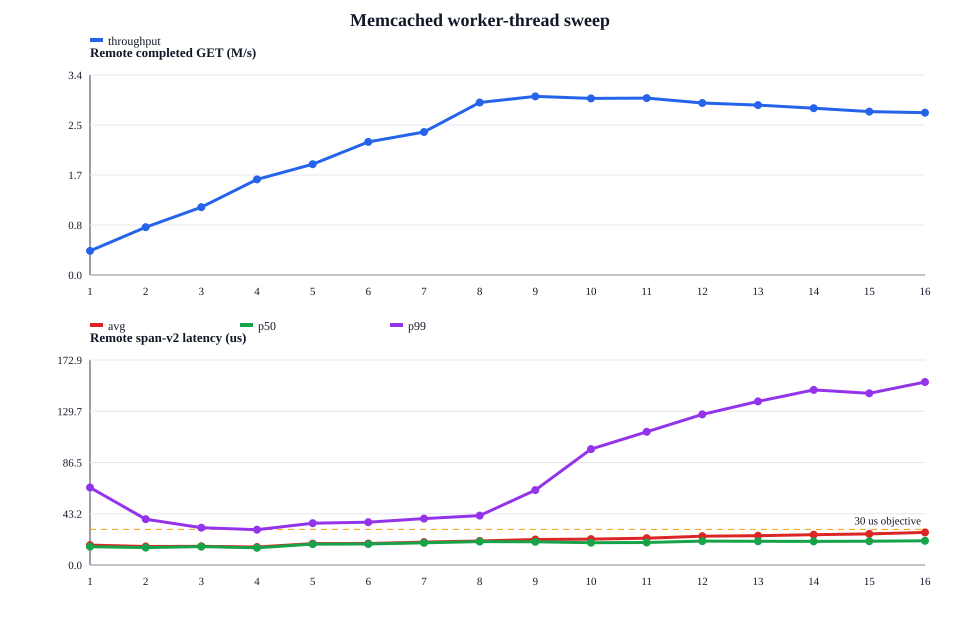
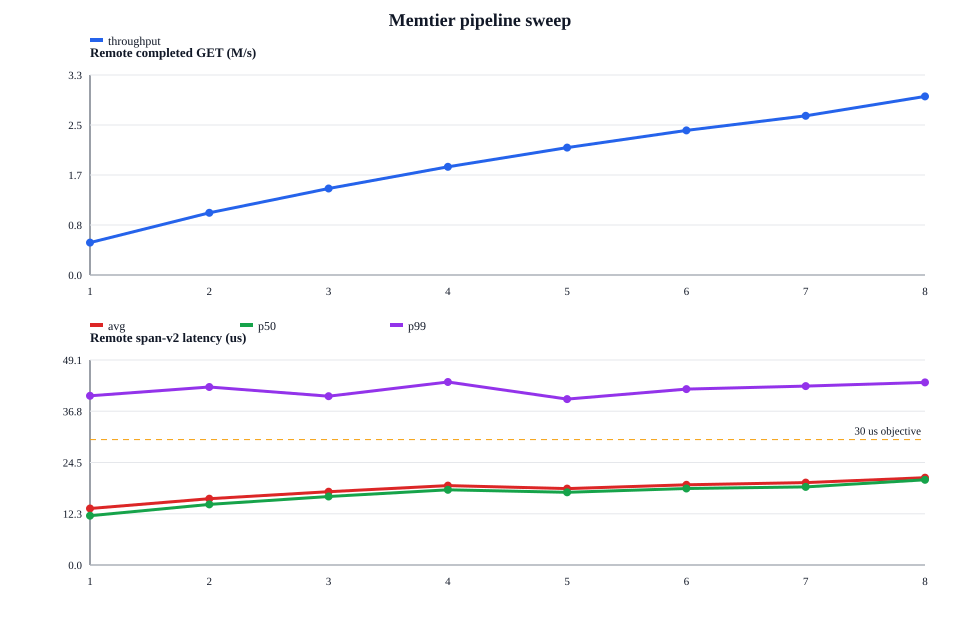

# Worker thread / pipeline 10초 민감도 실험

측정일: 2026-07-27

## 측정 조건

| 항목 | 값 |
|---|---|
| workload | GET-only, 64 B, 1,000,000 keys, point당 10초 |
| memtier | 8 threads × 16 clients/thread, CPU 16–23 |
| memcached | CPU 0–15, `-R 1024` |
| Port security | AES-256-GCM ON |
| 고정 기준점 | mcT=8, pipeline=8, QP/ext=8, depth=16 |
| throughput | `extstore_prof_read_count / 10s`; `cmd_get / 10s`와 일치 |
| latency | RDMA READ post 직전 → CQE → sync/private copy → decrypt 완료 |
| correctness | miss, badcrc, RDMA read failure, engine dead 모두 0 |

Port binary SHA-256은 `564505f4…cf33`, memtier는 `bb7c5275…6b80`이다.
현 구현에서 `QP = ext_threads = busy-poll IO thread`로 1:1이다. 변수 정의는
[`../GLOSSARY.md`](../GLOSSARY.md), 재현 절차는 [`experiment.md`](experiment.md)에 있다.

## 1. Memcached worker thread

고정값: mtT=8×c16, pipeline=8, QP/ext=8, depth=16.

주요 thread 합은 `mtT + mcT + ext_threads`다. dispatcher와 background thread
(LRU maintainer/crawler, slab rebalancer, assoc, logger)는 idle에 가까워 세지
않는다. 24 vCPU가 상한이므로 이 스윕(mtT=8, ext=8 고정)에서는 mcT≥9부터
초과다.

| mtT | mcT | QP=ext | remote GET M/s | avg µs | p50 µs | p99 µs |
|---:|---:|---:|---:|---:|---:|---:|
| 8 | 1 | 8 | 0.405 | 16.816 | 15.400 | 65.400 |
| 8 | 2 | 8 | 0.805 | 15.615 | 14.700 | 38.600 |
| 8 | 3 | 8 | 1.143 | 15.780 | 15.500 | 31.500 |
| 8 | 4 | 8 | 1.611 | **15.206** | **14.500** | **29.800** |
| 8 | 5 | 8 | 1.866 | 18.046 | 17.600 | 35.300 |
| 8 | 6 | 8 | 2.242 | 18.152 | 17.700 | 36.100 |
| 8 | 7 | 8 | 2.410 | 19.345 | 18.700 | 39.100 |
| 8 | 8 | 8 | 2.907 | 20.270 | 19.700 | 41.700 |
| 8 | 9 | 8 | **3.009** | 21.518 | 19.600 | 63.200 |
| 8 | 10 | 8 | 2.976 | 21.883 | 18.800 | 97.800 |
| 8 | 11 | 8 | 2.980 | 22.604 | 19.000 | 112.400 |
| 8 | 12 | 8 | 2.898 | 24.292 | 20.200 | 127.000 |
| 8 | 13 | 8 | 2.862 | 24.696 | 20.000 | 138.000 |
| 8 | 14 | 8 | 2.811 | 25.580 | 19.900 | 147.700 |
| 8 | 15 | 8 | 2.753 | 26.229 | 20.100 | 144.800 |
| 8 | 16 | 8 | 2.734 | 27.511 | 20.400 | 154.400 |

mcT=1→8은 worker 병렬도 증가에 따라 throughput이 0.405→2.907M/s로
증가한다. mcT=9에서 3.009M/s로 수치상 최대지만 주요 thread가 25개가 되어
24 vCPU를 초과하고 p99가 41.7→63.2µs로 뛴다. mcT≥10에서는 throughput도
감소하면서 p99가 최대 154.4µs까지 증가한다. 따라서 최대 throughput만 보면
mcT=9, 경합과 tail을 함께 보면 **mcT=8**이 안정적인 경계다.

## 2. Memtier pipeline

고정값: mtT=8×c16, mcT=8, QP/ext=8, depth=16.

| pipeline | remote GET M/s | avg µs | p50 µs | p99 µs |
|---:|---:|---:|---:|---:|
| 1 | 0.538 | **13.519** | **11.800** | 40.500 |
| 2 | 1.034 | 15.872 | 14.500 | 42.600 |
| 3 | 1.436 | 17.537 | 16.400 | 40.400 |
| 4 | 1.798 | 18.993 | 18.000 | 43.800 |
| 5 | 2.117 | 18.271 | 17.400 | **39.700** |
| 6 | 2.402 | 19.203 | 18.300 | 42.100 |
| 7 | 2.646 | 19.708 | 18.700 | 42.800 |
| 8 | **2.967** | 20.888 | 20.400 | 43.700 |

pipeline 1→8에서 throughput은 단조 증가하고 remote avg는 모두 21µs
미만이다. 이 범위에서는 queueing 증가가 `<30µs` avg objective를 침범하지
않으므로 **pipeline=8**이 최적이다. p99는 전 point에서 약 40–44µs이며
`<30µs`를 만족하지 않는다.

## 반복성 및 이전 실험과의 관계

같은 기준점은 thread 축에서 2.907M/s, pipeline 축에서 2.967M/s로 측정돼
평균 2.937M/s 대비 차이가 2.05%다. 같은 실행일 내부 반복성은 양호하다.

2026-07-24 frontier의 같은 binary·shape 실측 2.445M/s보다 이번 pipeline
축 결과가 21.32% 높다. 따라서 날짜가 다른 절대값을 합쳐 최적점을 고르지 않고,
이번 한 실행 안에서의 상대 추세를 결론 근거로 사용한다.

## 결론

- 유지할 운영점: **mtT=8×c16, mcT=8, pipeline=8, QP/ext=8, depth=16**.
- mcT=9는 throughput이 3.5% 높지만 24-vCPU 과할당이 시작되며 p99가 51.6%
  증가하므로 안정 운영점으로 채택하지 않는다.
- pipeline은 실험 범위 1–8에서 계속 scaling하며 pipeline=8이 최고 throughput과
  avg `<30µs`를 동시에 만족한다.

## 실행하지 않은 축

요청됐던 `QP/ext=1..16`과 `depth=1,2,4,8,16,32,64` 축은 admin이 실행 중
축소해서 측정하지 않았다. 그 두 축의 최신 근거는 여전히
[`CONFIG_MATRIX_10S_20260724.md`](CONFIG_MATRIX_10S_20260724.md)의
2026-07-24 실측이며, 그때의 고정 조건은 pipeline=4, depth=64다.

## Raw data

경로와 파일 수는 [`RAW_DATA_INDEX.md`](RAW_DATA_INDEX.md)에 정리돼 있다.
최초 실행의 `mc-thread-7/`은 사용자 요청으로 중단된 partial point다. 완결된
`stats-final.txt`와 CSV row가 없어 canonical 결과에서는 제외하고, 같은 point의
완결 raw는 continuation에 보존했다.
