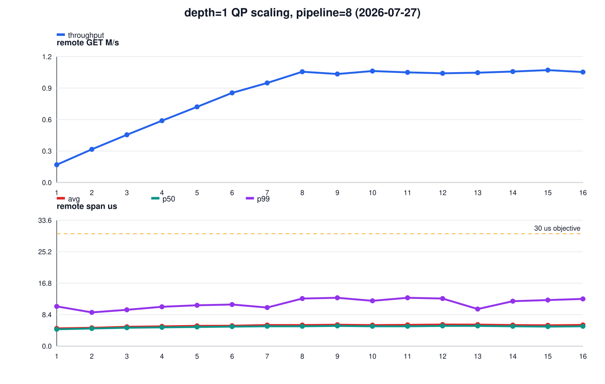
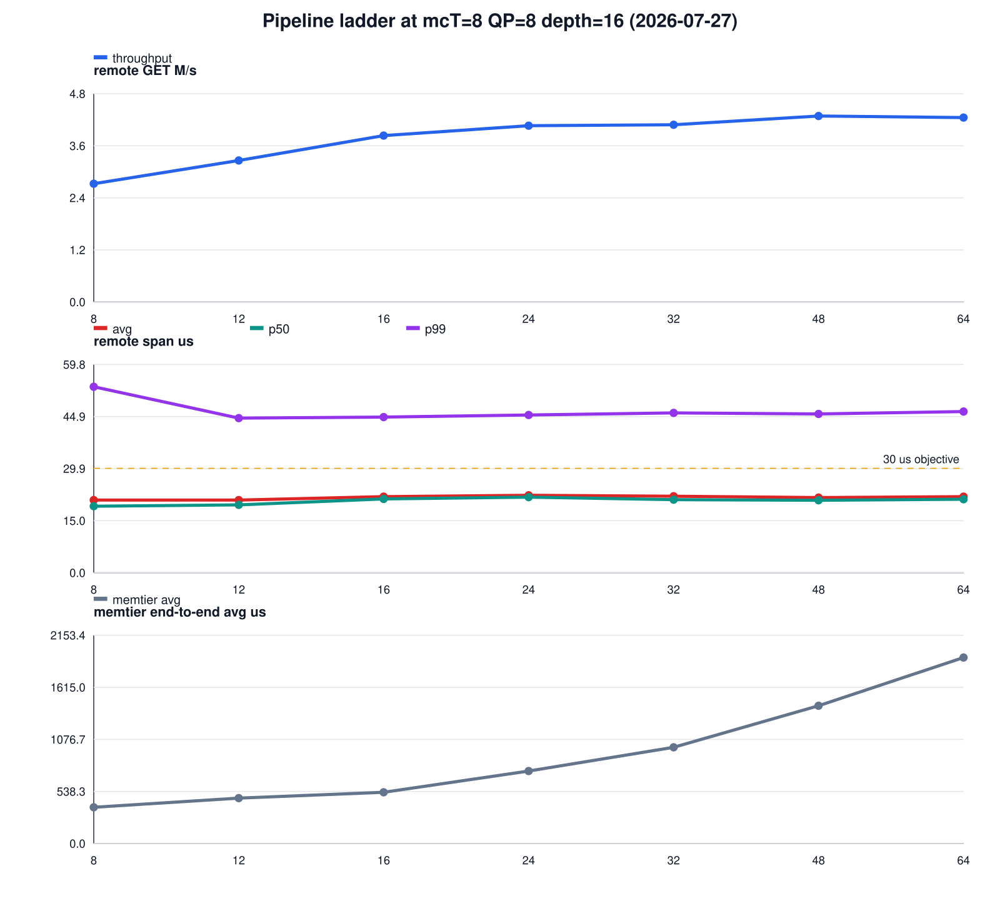
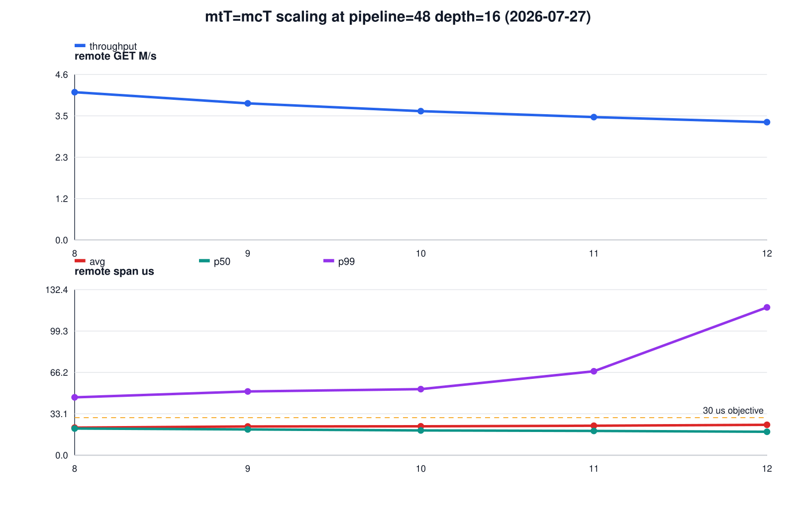

# 3실험 10초 sweep: QP×depth window · depth=1 QP scaling · pipeline plateau

측정일: 2026-07-27 (guest 재부팅 후 단일 실행, 33 points)

## 측정 조건

| 항목 | 값 |
|---|---|
| workload | GET-only, 64 B, 1,000,000 keys, point당 10초 |
| memtier | `mtT`×16 clients/thread, client가 상위 mtT개 CPU |
| memcached | `-R 1024`, server가 나머지 CPU |
| Port security | AES-256-GCM ON |
| 기준점 | mtT=8, mcT=8, pipeline=8, QP/ext=8, depth=16 |
| throughput | `extstore_prof_read_count / 10s`; `cmd_get / 10s`와 일치 |
| latency | span-v2: RDMA READ post 직전 → CQE → sync/private copy → decrypt 완료 |
| correctness | 전 33 point에서 miss, badcrc, RDMA read failure, engine dead = 0 |

Port binary SHA-256은 기존과 동일한 `564505f4…cf33`이다. guest는 이날
`md/02-런처-스크립트.md` 절차로 재부팅했다(6.16-snp-guest 커널 + snp_shared +
covlib mlx5_ib 7/24 build). 현 구현은 `QP = ext_threads = busy-poll IO thread`
1:1이므로 QP 변경은 IO thread 수(CPU 사용량) 변경을 동반한다 — 실험 1·2의
QP 축은 순수한 큐 구조 효과가 아니라 이 결합 효과다. QP>8 또는 mtT=mcT≥9
지점은 주요 thread(`mtT+mcT+ext`)가 24 vCPU를 초과하며, 의도된
oversubscription bounding point로 읽는다.

## 1. QP×depth=128 고정 window

고정값: mtT=8, mcT=8, pipeline=8, `QP×depth=128`.

| QP×depth | remote GET M/s | avg µs | p50 µs | p99 µs | post→CQE µs |
|---:|---:|---:|---:|---:|---:|
| 1×128 | 0.748 | 65.708 | 64.100 | 111.800 | 44.222 |
| 2×64 | 1.524 | 65.113 | 62.300 | 118.600 | 43.477 |
| 4×32 | 2.518 | 36.859 | 35.800 | 67.900 | 24.234 |
| 8×16 | 2.678 | 21.097 | 19.000 | 62.700 | 11.334 |
| 16×8 | 2.649 | **13.952** | **12.600** | **34.800** | **8.268** |

같은 128 in-flight 상한에서 throughput은 QP=8에 포화(2.65–2.68M/s)하지만
latency는 QP를 늘릴수록 계속 내려간다(avg 65.7→14.0µs). 좁고 깊은 큐는
post→CQE 대기(44µs)로 나타나고, 넓고 얕게 펴면 같은 총량에서 per-QP
queueing이 사라진다. 16×8은 32 major thread로 oversubscribed인데도 이
load에서는 불이익이 없고 p99 34.8µs로 p99 `<30µs`에 가장 근접했다.

## 2. depth=1 QP scaling

고정값: mtT=8, mcT=8, pipeline=8, depth=1. per-QP 미결 READ가 1이므로 큐
대기가 없는 순수 병렬도 축이다.

| QP | remote GET M/s | avg µs | p99 µs | | QP | remote GET M/s | avg µs | p99 µs |
|---:|---:|---:|---:|---|---:|---:|---:|---:|
| 1 | 0.168 | 4.742 | 10.600 | | 9 | 1.026 | 5.708 | 12.900 |
| 2 | 0.314 | 4.894 | 9.000 | | 10 | 1.054 | 5.614 | 12.100 |
| 3 | 0.451 | 5.154 | 9.700 | | 11 | 1.042 | 5.671 | 12.900 |
| 4 | 0.585 | 5.273 | 10.500 | | 12 | 1.033 | 5.764 | 12.700 |
| 5 | 0.716 | 5.403 | 10.900 | | 13 | 1.039 | 5.740 | 9.900 |
| 6 | 0.848 | 5.445 | 11.100 | | 14 | 1.049 | 5.636 | 12.000 |
| 7 | 0.942 | 5.636 | 10.300 | | 15 | 1.063 | 5.555 | 12.300 |
| 8 | **1.048** | 5.629 | 12.700 | | 16 | 1.045 | 5.654 | 12.600 |

QP 1→8은 QP당 약 0.131M/s로 선형 스케일링하고, QP 9–16은 ~1.05M/s에서
정체한다(24 vCPU 초과 구간). 전 16 point가 avg 4.7–5.8µs, p99 9.0–12.9µs로
**p99 `<30µs`를 처음으로 넓은 구간에서 충족**했다. 이전 matrix에서 p99를
통과한 유일 지점이 depth=1 (pipeline=4, 0.973M/s, p99 21.2µs)이었는데,
pipeline=8에서는 1.048M/s로 오르면서 p99가 12.7µs로 오히려 내려간다.
**p99 `<30µs` 조건의 현재 상한은 depth=1, QP=8의 1.05M/s다.**

## 3. Pipeline plateau와 thread scaling

### 3a. Pipeline ladder

고정값: mtT=8, mcT=8, QP/ext=8, depth=16.

| pipeline | remote GET M/s | avg µs | p99 µs | memtier e2e avg µs |
|---:|---:|---:|---:|---:|
| 8 | 2.705 | 20.859 | 53.400 | 374.450 |
| 12 | 3.235 | 20.860 | 44.400 | 469.200 |
| 16 | 3.804 | 21.850 | 44.700 | 530.220 |
| 24 | 4.030 | 22.252 | 45.300 | 749.090 |
| 32 | 4.051 | 21.967 | 45.900 | 995.020 |
| 48 | **4.251** | 21.591 | 45.600 | 1424.120 |
| 64 | 4.217 | 21.845 | 46.300 | 1922.660 |

throughput은 pipeline 8→24에서 2.705→4.030M/s로 오르고 24부터 ~4.2M/s에서
평탄해진다(argmax는 48의 4.251M/s, 32 대비 +4.9%; 64는 하락). 핵심 관찰 두 가지:

- **remote span은 pipeline에 무감하다.** avg 20.9–22.3µs, p99 44–53µs로 전
  구간 평탄하다. depth=16이 RDMA in-flight를 자르기 때문에 초과 offered
  load는 post 이전에 대기하고, span-v2 창 안으로 들어오지 않는다.
- 그 대기는 memtier end-to-end에 나타난다: avg 374µs→1.92ms로 pipeline에
  거의 비례해 증가한다. remote-span 기준 avg `<30µs` objective는 pipeline=48
  에서도 성립하지만(21.6µs), client 관점 latency는 pipeline 8 대비 3.8배다.

기존 pipeline 스윕(depth=64, 2026-07-24)은 pipeline=32에서 avg 68.9µs로
objective를 깨뜨렸다. depth=16에서는 같은 avg 예산으로 4.25M/s까지 열린다 —
**remote-span avg `<30µs`만 요구한다면 최대 throughput 지점은 더 이상
pipeline=8(2.7M/s)이 아니라 pipeline=48(4.25M/s)이다.** 10M 대비로는
42.5%, 2.35× 부족이다.

### 3b. mtT=mcT scaling (pipeline=48)

고정값: QP/ext=8, depth=16, pipeline=48 (3a의 argmax). `mtT=mcT=T`로 함께
올린다. T=9부터 주요 thread가 24 vCPU를 초과한다.

| mtT=mcT | 총 주요 thread | remote GET M/s | avg µs | p99 µs | memtier e2e p99 µs |
|---:|---:|---:|---:|---:|---:|
| 8 | 24 | **4.143** | 22.068 | 46.300 | 2639 |
| 9 | 26 | 3.831 | 22.940 | 51.000 | 6207 |
| 10 | 28 | 3.612 | 23.075 | 52.800 | 6431 |
| 11 | 30 | 3.446 | 23.557 | 67.100 | 6975 |
| 12 | 32 | 3.304 | 24.270 | 118.200 | 7679 |

단조 감소다. T=12는 T=8 대비 throughput -20%, remote p99 2.6배, e2e p99
2.9배다. **3a의 plateau는 thread 부족이 원인이 아니다** — 24 vCPU 고정에서
mtT/mcT를 함께 올리는 것은 순손실이며, 8/8이 이 shape의 상한이다.

## 반복성

기준 shape(8/8/8/16, pipeline=8)이 이 실행 안에 두 번 있다: 2.678M/s
(qpxdepth)와 2.705M/s(plateau), 차이 1.0%. 같은 날 sensitivity 실행의
2.907–2.967M/s와는 7–10% 차이가 있는데, 그 사이 guest가 재부팅되어 모듈
스택이 재구성됐다. 기존 원칙대로 실행(부팅)이 다른 절대값은 비교하지 않고,
한 실행 안의 상대 추세만 결론 근거로 쓴다.

## 결론

- 같은 in-flight 총량이면 **넓고 얕게**: QP×depth=128에서 8×16→16×8은
  throughput 동일, avg 21.1→14.0µs, p99 62.7→34.8µs.
- **p99 `<30µs`가 목표면 depth=1이 유일한 영역**이고, 상한은 QP=8의
  1.05M/s다(전 구간 p99 ≤13µs로 큰 여유).
- **avg `<30µs`(remote span 기준)가 목표면 pipeline=48, 4.25M/s**가 새
  상한이다. 단 client e2e는 1.4ms로, latency 목표를 어느 창에서 정의하느냐에
  따라 운영점이 갈린다.
- pipeline plateau(~4.2M/s)는 thread를 늘려도 풀리지 않는다. mtT=mcT=8이
  24-vCPU shape의 상한이다.

## 재현물

- runner: `tools/config-matrix-10s.sh`, `PHASES="qpxdepth qpd1 plateau"`
- plotter: `tools/plot-three-exp.py`
- raw: `/home/seonung/2026/rdma-results/three-exp-20260727-082205/` (33 points,
  300 files) — 파일 구성은 [`RAW_DATA_INDEX.md`](RAW_DATA_INDEX.md)
