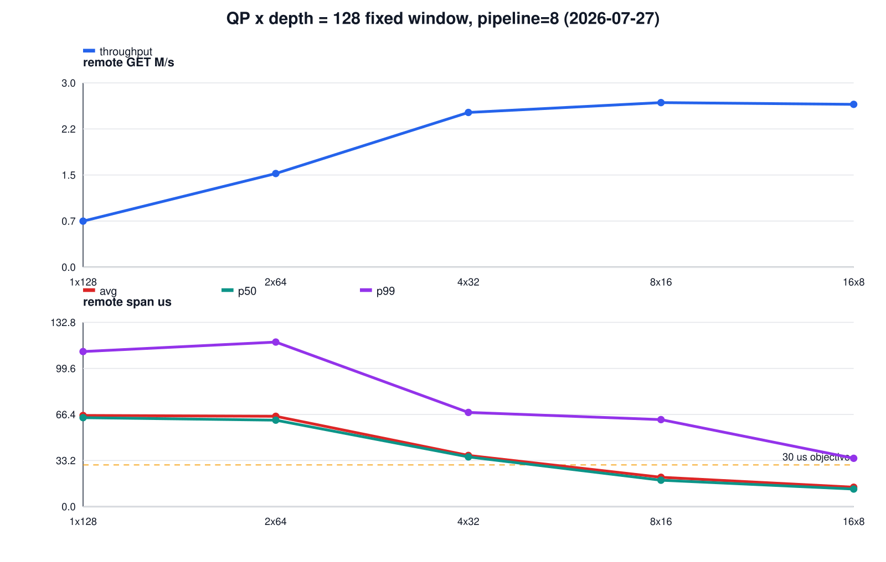
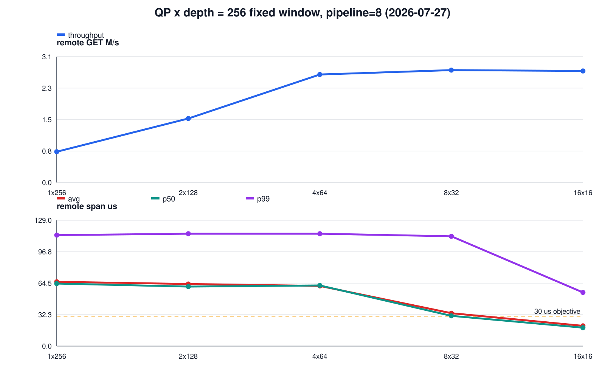
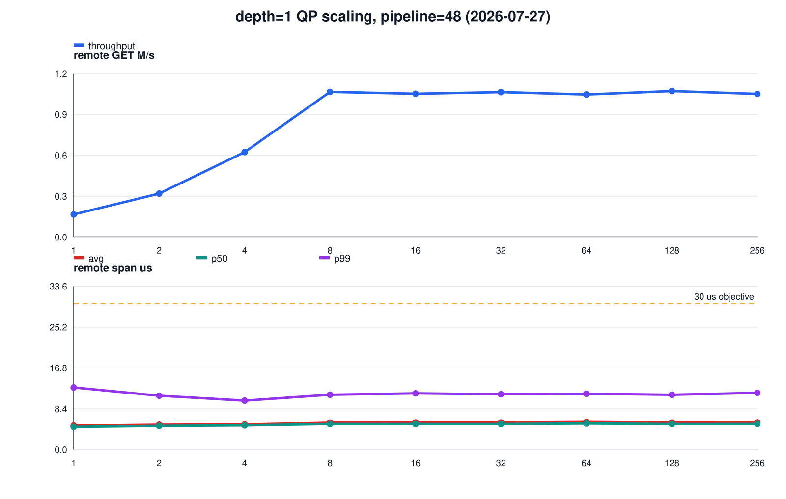
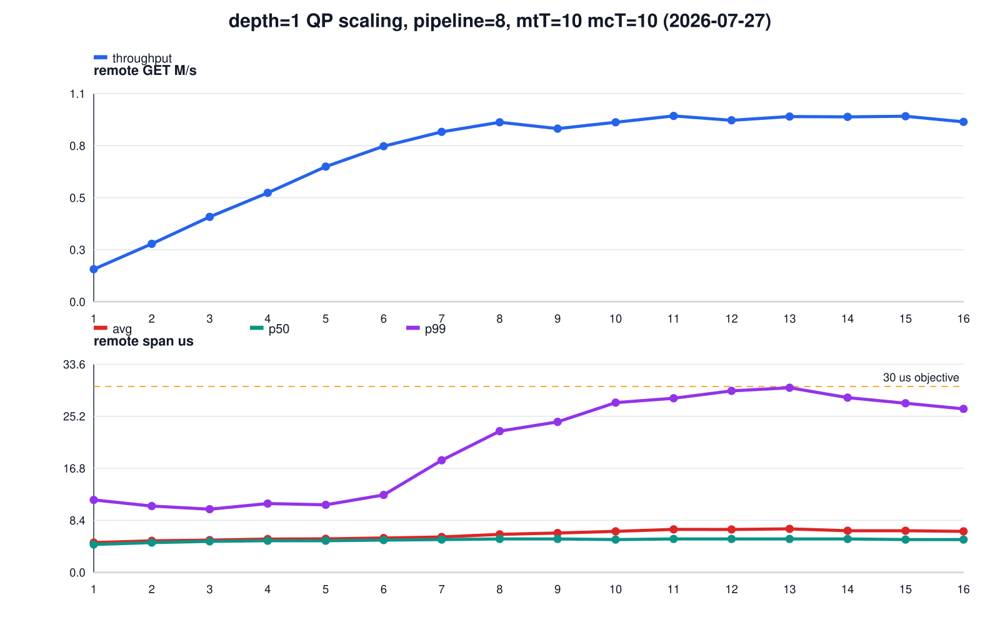
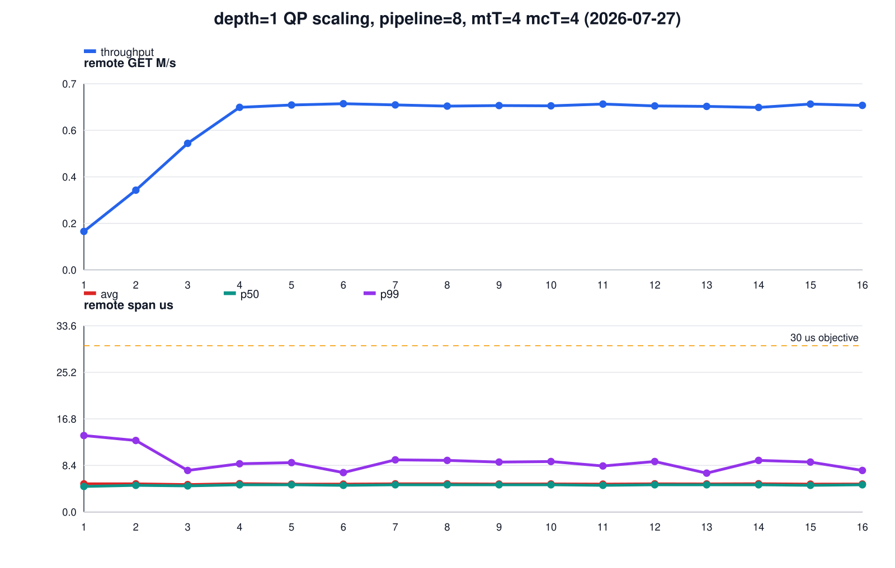

# 3실험 10초 sweep: QP×depth window · depth=1 QP scaling · pipeline plateau

측정일: 2026-07-27 (guest 재부팅 후 단일 실행 33 points + window=256 5 points +
고QP 확장 7 points + depth=1 pipeline=48 9 points + depth=1 mtT=mcT=10 16 points +
depth=1 mtT=mcT=4 16 points)

## 측정 조건

| 항목 | 값 |
|---|---|
| workload | GET-only, 64 B, 1,000,000 keys, point당 10초 |
| memtier | `mtT`×16 clients/thread, client가 상위 mtT개 CPU |
| memcached | `-R 1024`, server가 나머지 CPU |
| Port security | AES-256-GCM ON |
| 기준점 | mtT=8, mcT=8, pipeline=8, QP/ext=8, depth=16 |
| throughput | `extstore_prof_read_count / 10s`; `cmd_get / 10s`와 일치 |
| latency | span-v2: RDMA READ post 직전 → CQE → sync/private copy → decrypt 완료 |
| correctness | 전 33 point에서 miss, badcrc, RDMA read failure, engine dead = 0 |

Port binary SHA-256은 기존과 동일한 `564505f4…cf33`이다. guest는 이날
`md/02-런처-스크립트.md` 절차로 재부팅했다(6.16-snp-guest 커널 + snp_shared +
covlib mlx5_ib 7/24 build). 현 구현은 `QP = ext_threads = busy-poll IO thread`
1:1이므로 QP 변경은 IO thread 수(CPU 사용량) 변경을 동반한다 — 실험 1·2의
QP 축은 순수한 큐 구조 효과가 아니라 이 결합 효과다. QP>8 또는 mtT=mcT≥9
지점은 주요 thread(`mtT+mcT+ext`)가 24 vCPU를 초과하며, 의도된
oversubscription bounding point로 읽는다.

## 1. QP×depth=128 고정 window

고정값: mtT=8, mcT=8, pipeline=8, `QP×depth=128`.

| QP×depth | remote GET M/s | avg µs | p50 µs | p99 µs | post→CQE µs |
|---:|---:|---:|---:|---:|---:|
| 1×128 | 0.748 | 65.708 | 64.100 | 111.800 | 44.222 |
| 2×64 | 1.524 | 65.113 | 62.300 | 118.600 | 43.477 |
| 4×32 | 2.518 | 36.859 | 35.800 | 67.900 | 24.234 |
| 8×16 | **2.678** | 21.097 | 19.000 | 62.700 | 11.334 |
| 16×8 | 2.649 | 13.952 | 12.600 | 34.800 | 8.268 |
| 32×4 | 2.396 | 10.550 | 9.500 | 36.000 | 6.943 |
| 64×2 | 1.438 | 8.751 | 8.100 | 34.000 | 5.918 |
| 128×1 | 1.051 | **5.643** | **5.300** | **12.600** | **2.987** |

QP 32–128은 별도 실행(`qpxd128-highqp`)이며, 서버 코어 16개에 busy-poll
thread 32–128개를 얹는 극단적 oversubscription 구간이다. 전 점 `status=ok`.

같은 128 in-flight 상한에서 곡선은 종 모양이다. throughput은 QP=8에서 최대
(2.678M/s)이고 QP=16까지 유지되다가, QP≥32에서 감소해 128×1의 1.051M/s —
실험 2에서 확인한 depth=1 천장 — 로 수렴한다. latency는 QP 증가에 단조
하강한다(avg 65.7→5.6µs). 좁고 깊은 큐는 post→CQE 대기(44µs)로 나타나고,
넓게 펴면 per-QP queueing이 사라지되, QP가 코어 수를 크게 초과하면 busy-poll
경합으로 throughput을 잃는다. p99는 QP≥16에서 34–36µs로 안정되고 depth=1이
되어야 12.6µs로 떨어진다.

### 1b. window=256 재실험

같은 고정값(mtT=8, mcT=8, pipeline=8)에서 `QP×depth=256`으로 반복했다.

| QP×depth | remote GET M/s | avg µs | p50 µs | p99 µs | (같은 QP의 w128 대비) |
|---:|---:|---:|---:|---:|---|
| 1×256 | 0.748 | 65.929 | 64.500 | 113.800 | M/s ±0%, avg +0.3% |
| 2×128 | 1.557 | 63.684 | 61.900 | 115.200 | M/s +2.2%, avg -2.2% |
| 4×64 | 2.627 | 61.687 | 63.100 | 115.200 | M/s +4.3%, avg +67% |
| 8×32 | **2.733** | 33.745 | 32.100 | 112.600 | M/s +2.1%, avg +60% |
| 16×16 | 2.712 | 20.784 | 19.200 | 55.000 | M/s +2.4%, avg +49% |
| 32×8 | 2.638 | 14.159 | 12.900 | 34.700 | M/s +10.1%, avg +34% |
| 64×4 | 2.457 | 10.484 | 9.500 | 33.800 | M/s +70.9%, avg +20% |
| 128×2 | 1.411 | 8.721 | 8.100 | 34.200 | M/s +34.3%, avg +55% |
| 256×1 | 1.042 | **5.712** | **5.400** | **12.200** | (짝 없음; 128×1과 동일 수준) |

- QP=1–2에서는 두 window의 결과가 사실상 같다. 실측 in-flight
  (`throughput×avg` ≈ 49, 99)가 이미 128 미만이라 window가 바인딩되지 않는
  구간이기 때문이다.
- window가 바인딩되고 코어 예산 안인 QP=4–16에서는 256이 throughput을
  +2–4%만 올리는 대신 avg를 49–67% 올린다. 깊이로 산 것은 대기시간뿐이다.
- **QP≥32의 경합 구간에서는 관계가 뒤집힌다**: 같은 QP에서 depth가 큰 쪽이
  throughput을 크게 회복한다(64×4는 64×2 대비 +71%). busy-poll thread가
  스케줄러에 밀려 있는 동안 깊은 큐가 NIC을 계속 먹여 주기 때문이다.
- depth가 1–2로 떨어지면 QP 수와 무관하게 throughput이 depth 바닥에 갇힌다:
  depth=1 → ~1.05M/s(QP 128이든 256이든), depth=2 → ~1.4M/s(QP 64든 128이든).
  이 바닥은 실험 2의 depth=1 천장과 같은 값이다.
- pipeline=8의 throughput 최대(~2.7M/s)는 window 총량 제약이 아니다 —
  128→256으로 정점이 사실상 움직이지 않았다(2.678→2.733M/s, +2.1%).

## 2. depth=1 QP scaling

고정값: mtT=8, mcT=8, pipeline=8, depth=1. per-QP 미결 READ가 1이므로 큐
대기가 없는 순수 병렬도 축이다.

| QP | remote GET M/s | avg µs | p99 µs | | QP | remote GET M/s | avg µs | p99 µs |
|---:|---:|---:|---:|---|---:|---:|---:|---:|
| 1 | 0.168 | 4.742 | 10.600 | | 9 | 1.026 | 5.708 | 12.900 |
| 2 | 0.314 | 4.894 | 9.000 | | 10 | 1.054 | 5.614 | 12.100 |
| 3 | 0.451 | 5.154 | 9.700 | | 11 | 1.042 | 5.671 | 12.900 |
| 4 | 0.585 | 5.273 | 10.500 | | 12 | 1.033 | 5.764 | 12.700 |
| 5 | 0.716 | 5.403 | 10.900 | | 13 | 1.039 | 5.740 | 9.900 |
| 6 | 0.848 | 5.445 | 11.100 | | 14 | 1.049 | 5.636 | 12.000 |
| 7 | 0.942 | 5.636 | 10.300 | | 15 | 1.063 | 5.555 | 12.300 |
| 8 | **1.048** | 5.629 | 12.700 | | 16 | 1.045 | 5.654 | 12.600 |

QP 1→8은 QP당 약 0.131M/s로 선형 스케일링하고, QP 9–16은 ~1.05M/s에서
정체한다(24 vCPU 초과 구간). 전 16 point가 avg 4.7–5.8µs, p99 9.0–12.9µs로
**p99 `<30µs`를 처음으로 넓은 구간에서 충족**했다. 이전 matrix에서 p99를
통과한 유일 지점이 depth=1 (pipeline=4, 0.973M/s, p99 21.2µs)이었는데,
pipeline=8에서는 1.048M/s로 오르면서 p99가 12.7µs로 오히려 내려간다.
**p99 `<30µs` 조건의 현재 상한은 depth=1, QP=8의 1.05M/s다.**

### 2b. pipeline=48 재실험 (QP=1..256)

정체 원인이 offered load(pipeline=8)인지 확인하기 위해 pipeline=48로 같은
축을 QP=256까지 반복했다. 고정값: mtT=8, mcT=8, depth=1.

| QP | remote GET M/s | avg µs | p99 µs | | QP | remote GET M/s | avg µs | p99 µs |
|---:|---:|---:|---:|---|---:|---:|---:|---:|
| 1 | 0.162 | 4.962 | 12.800 | | 32 | 1.035 | 5.610 | 11.400 |
| 2 | 0.311 | 5.134 | 11.100 | | 64 | 1.018 | 5.704 | 11.500 |
| 4 | 0.607 | 5.198 | 10.100 | | 128 | 1.042 | 5.602 | 11.300 |
| 8 | 1.037 | 5.560 | 11.300 | | 256 | 1.022 | 5.625 | 11.700 |
| 16 | 1.023 | 5.610 | 11.600 | | | | | |

- QP≤8은 pipeline=8 계열과 동일하다(선형 구간은 per-QP 왕복 한계라 offered
  load와 무관).
- QP≥8은 **pipeline을 6배(8→48), QP를 16배(16→256) 늘려도 ~1.02–1.04M/s에서
  전혀 움직이지 않는다.** avg 5.6µs로 in-flight=QP라면 QP=16만 돼도 이론상
  ~2.9M/s여야 하므로, fabric·QP 수·offered load 어느 것도 병목이 아니다.
  천장은 depth=1일 때 요청 하나하나가 개별로 겪는 서버 내부 경로
  (worker→IO thread 전달과 per-completion 처리)의 처리율이다. §1b에서 depth=2
  바닥이 ~1.4M/s로 올라가는 것과 정합적이다 — depth가 per-completion 비용을
  amortize한다.
- latency는 QP=256(busy-poll thread 256개)에서도 avg 5.6µs / p99 11.7µs로
  유지된다. depth=1 영역은 극단적 oversubscription에도 tail이 무너지지
  않는다.
- 결론: **depth=1 천장 1.05M/s는 offered load로 뚫리지 않는다.** p99 예산을
  지키며 그 이상을 원하면 depth=2(§1b 바닥 ~1.4M/s, 단 p99 ~34µs로 예산
  초과) 또는 per-completion 비용 자체의 최적화가 필요하다.

### 2c. mtT=mcT=10 재실험 (QP=1..16)

남은 가설인 worker 병렬도를 확인하기 위해 §2와 같은 축(pipeline=8, depth=1,
QP=1..16)을 mtT=mcT=10으로 반복했다. CPU 분할은 runner 로직대로 client
14–23(10코어), server 0–13(14코어)이다.

| mtT | mcT | QP=ext | remote GET M/s | avg µs | p99 µs | | mtT | mcT | QP=ext | remote GET M/s | avg µs | p99 µs |
|---:|---:|---:|---:|---:|---:|---|---:|---:|---:|---:|---:|---:|
| 10 | 10 | 1 | 0.169 | 4.812 | 11.700 | | 10 | 10 | 9 | 0.895 | 6.346 | 24.300 |
| 10 | 10 | 2 | 0.300 | 5.091 | 10.700 | | 10 | 10 | 10 | 0.928 | 6.627 | 27.400 |
| 10 | 10 | 3 | 0.439 | 5.207 | 10.200 | | 10 | 10 | 11 | 0.961 | 6.935 | 28.100 |
| 10 | 10 | 4 | 0.563 | 5.378 | 11.100 | | 10 | 10 | 12 | 0.938 | 6.920 | 29.300 |
| 10 | 10 | 5 | 0.699 | 5.418 | 10.900 | | 10 | 10 | 13 | 0.957 | 7.029 | 29.800 |
| 10 | 10 | 6 | 0.804 | 5.540 | 12.500 | | 10 | 10 | 14 | 0.956 | 6.727 | 28.200 |
| 10 | 10 | 7 | 0.878 | 5.708 | 18.100 | | 10 | 10 | 15 | 0.959 | 6.720 | 27.300 |
| 10 | 10 | 8 | 0.928 | 6.126 | 22.800 | | 10 | 10 | 16 | 0.930 | 6.618 | 26.400 |

- worker를 8→10으로 늘려도 천장은 오르지 않는다. 오히려 정체선이
  ~0.93–0.96M/s로 **t8 대비 약 9% 낮고**, avg가 5.6→6.6–7.0µs, p99가
  9–13→22–30µs로 악화된다. QP≥10에서는 p99가 30µs 목표선에 닿기 직전까지
  올라간다.
- 선형 구간(QP≤6)도 t8보다 기울기가 약간 낮다(예: q4 0.585→0.563). server
  코어는 16→14로 줄었는데 worker는 늘어, depth=1의 요청당 개별 왕복 경로가
  스케줄링 잡음만 더 겪는다.
- §2b와 합치면 depth=1 천장의 소거법이 완성된다: offered load(×), QP 수(×),
  **worker 수(×)** — 남는 것은 요청 하나가 개별로 지나는 per-completion
  경로의 직렬 비용뿐이며, worker/thread를 더하는 것은 그 경로에 잡음을 얹어
  오히려 해가 된다.

### 2d. mtT=mcT=4 재실험 (QP=1..16)

worker를 반대로 줄여 공급률 하한을 확인했다. 고정값: pipeline=8, depth=1,
mtT=mcT=4. CPU 분할은 client 20–23(4코어), server 0–19(20코어)로, QP=16에서도
주요 thread가 4+4+16=24라 **전 구간이 처음으로 24 vCPU 예산 안**이다.

최초 시도는 QP=9 지점 직후 guest(qemu)가 죽어 중단됐고(9 points 보존,
canonical 제외), guest 재부팅 후 16 point 전체를 한 실행으로 다시 측정했다.
겹치는 9 point는 부팅이 달라졌는데도 오차 범위에서 일치한다.

| mtT | mcT | QP=ext | remote GET M/s | avg µs | p99 µs | | mtT | mcT | QP=ext | remote GET M/s | avg µs | p99 µs |
|---:|---:|---:|---:|---:|---:|---|---:|---:|---:|---:|---:|---:|
| 4 | 4 | 1 | 0.153 | 5.081 | 13.800 | | 4 | 4 | 9 | 0.653 | 5.041 | 9.000 |
| 4 | 4 | 2 | 0.317 | 5.082 | 12.900 | | 4 | 4 | 10 | 0.651 | 5.065 | 9.100 |
| 4 | 4 | 3 | 0.502 | 4.931 | 7.500 | | 4 | 4 | 11 | 0.658 | 5.024 | 8.300 |
| 4 | 4 | 4 | 0.645 | 5.107 | 8.700 | | 4 | 4 | 12 | 0.651 | 5.071 | 9.100 |
| 4 | 4 | 5 | 0.655 | 5.031 | 8.900 | | 4 | 4 | 13 | 0.649 | 5.055 | 7.000 |
| 4 | 4 | 6 | 0.660 | 5.030 | 7.100 | | 4 | 4 | 14 | 0.645 | 5.091 | 9.300 |
| 4 | 4 | 7 | 0.655 | 5.069 | 9.400 | | 4 | 4 | 15 | 0.658 | 5.023 | 9.000 |
| 4 | 4 | 8 | 0.650 | 5.079 | 9.300 | | 4 | 4 | 16 | 0.653 | 5.043 | 7.500 |

- 선형 구간은 QP=4에서 끝나고 **~0.65M/s에 정체한다 — 정체 시작 QP가 정확히
  mcT와 일치한다** (t8은 QP=8에서 1.05M/s 정체). CPU 예산이 전 구간
  넉넉한데도 그렇다.
- worker당 공급률로 보면 mcT=4는 0.163M/s/worker, mcT=8은 0.131, mcT=10은
  0.093이다. **depth=1 천장 = worker 공급률 × worker 수 (단, 8까지만
  스케일하고 그 이상은 경합으로 역효과)**로 정리된다. §2b·§2c와 합치면:
  천장의 근원은 worker thread가 요청마다 개별로 지불하는 per-request 직렬
  비용이고, QP·pipeline은 그것을 못 바꾸며, worker는 8까지만 그것을
  병렬화한다.
- 전 16 point의 avg가 4.9–5.1µs, p99 7.0–13.8µs로 세 계열 중 가장 낮고
  평평하다. CPU 예산 안에서는 depth=1 tail이 QP와 무관하게 안정적이다.

## 3. Pipeline plateau와 thread scaling

### 3a. Pipeline ladder

고정값: mtT=8, mcT=8, QP/ext=8, depth=16.

| pipeline | remote GET M/s | avg µs | p99 µs | memtier e2e avg µs |
|---:|---:|---:|---:|---:|
| 8 | 2.705 | 20.859 | 53.400 | 374.450 |
| 12 | 3.235 | 20.860 | 44.400 | 469.200 |
| 16 | 3.804 | 21.850 | 44.700 | 530.220 |
| 24 | 4.030 | 22.252 | 45.300 | 749.090 |
| 32 | 4.051 | 21.967 | 45.900 | 995.020 |
| 48 | **4.251** | 21.591 | 45.600 | 1424.120 |
| 64 | 4.217 | 21.845 | 46.300 | 1922.660 |

throughput은 pipeline 8→24에서 2.705→4.030M/s로 오르고 24부터 ~4.2M/s에서
평탄해진다(argmax는 48의 4.251M/s, 32 대비 +4.9%; 64는 하락). 핵심 관찰 두 가지:

- **remote span은 pipeline에 무감하다.** avg 20.9–22.3µs, p99 44–53µs로 전
  구간 평탄하다. depth=16이 RDMA in-flight를 자르기 때문에 초과 offered
  load는 post 이전에 대기하고, span-v2 창 안으로 들어오지 않는다.
- 그 대기는 memtier end-to-end에 나타난다: avg 374µs→1.92ms로 pipeline에
  거의 비례해 증가한다. remote-span 기준 avg `<30µs` objective는 pipeline=48
  에서도 성립하지만(21.6µs), client 관점 latency는 pipeline 8 대비 3.8배다.

기존 pipeline 스윕(depth=64, 2026-07-24)은 pipeline=32에서 avg 68.9µs로
objective를 깨뜨렸다. depth=16에서는 같은 avg 예산으로 4.25M/s까지 열린다 —
**remote-span avg `<30µs`만 요구한다면 최대 throughput 지점은 더 이상
pipeline=8(2.7M/s)이 아니라 pipeline=48(4.25M/s)이다.** 10M 대비로는
42.5%, 2.35× 부족이다.

### 3b. mtT=mcT scaling (pipeline=48)

고정값: QP/ext=8, depth=16, pipeline=48 (3a의 argmax). `mtT=mcT=T`로 함께
올린다. T=9부터 주요 thread가 24 vCPU를 초과한다.

| mtT | mcT | QP=ext | remote GET M/s | avg µs | p99 µs | memtier e2e p99 µs |
|---:|---:|---:|---:|---:|---:|---:|
| 8 | 8 | 8 | **4.143** | 22.068 | 46.300 | 2639 |
| 9 | 9 | 8 | 3.831 | 22.940 | 51.000 | 6207 |
| 10 | 10 | 8 | 3.612 | 23.075 | 52.800 | 6431 |
| 11 | 11 | 8 | 3.446 | 23.557 | 67.100 | 6975 |
| 12 | 12 | 8 | 3.304 | 24.270 | 118.200 | 7679 |

단조 감소다. T=12는 T=8 대비 throughput -20%, remote p99 2.6배, e2e p99
2.9배다. **3a의 plateau는 thread 부족이 원인이 아니다** — 24 vCPU 고정에서
mtT/mcT를 함께 올리는 것은 순손실이며, 8/8이 이 shape의 상한이다.

## 반복성

기준 shape(8/8/8/16, pipeline=8)이 이 실행 안에 두 번 있다: 2.678M/s
(qpxdepth)와 2.705M/s(plateau), 차이 1.0%. 같은 날 sensitivity 실행의
2.907–2.967M/s와는 7–10% 차이가 있는데, 그 사이 guest가 재부팅되어 모듈
스택이 재구성됐다. 기존 원칙대로 실행(부팅)이 다른 절대값은 비교하지 않고,
한 실행 안의 상대 추세만 결론 근거로 쓴다.

## 결론

- 같은 in-flight 총량이면 **QP≈8–32까지는 넓고 얕게**가 지배한다: throughput
  유지 또는 소폭 손실에 avg가 계단식으로 내려간다(21.1→14.0→10.5µs). QP가
  코어를 크게 넘어서면(≥64) busy-poll 경합으로 throughput이 depth 바닥
  (depth=1 ≈ 1.05M/s, depth=2 ≈ 1.4M/s)으로 수렴하고, 그 구간에서는 같은
  QP라면 깊은 쪽이 낫다. 두 window의 throughput–latency frontier:
  2.73M/s@33.7µs(8×32) → 2.71@20.8(16×16) → 2.64@14.2(32×8) →
  2.46@10.5(64×4) → 1.05@5.6(128×1).
- **p99 `<30µs`가 목표면 depth=1이 유일한 영역**이고, 상한은 QP=8의
  1.05M/s다(전 구간 p99 ≤13µs로 큰 여유). 이 천장은 QP를 256까지,
  pipeline을 48까지 올려도 불변이다(§2b) — 병목은 offered load가 아니라
  depth=1이 amortize하지 못하는 per-completion 서버 내부 비용이다.
- **avg `<30µs`(remote span 기준)가 목표면 pipeline=48, 4.25M/s**가 새
  상한이다. 단 client e2e는 1.4ms로, latency 목표를 어느 창에서 정의하느냐에
  따라 운영점이 갈린다.
- pipeline plateau(~4.2M/s)는 thread를 늘려도 풀리지 않는다. mtT=mcT=8이
  24-vCPU shape의 상한이다.

## 재현물

- runner: `tools/config-matrix-10s.sh`, `PHASES="qpxdepth qpd1 plateau"`
  (§1b는 `PHASES=qpxdepth QPXD_WINDOW=256`, 고QP 확장은 `QPXD_QPS="32 64 128 [256]"`,
  §2b는 `PHASES=qpd1 QPD1_PIPELINE=48 QPD1_QPS="1 2 4 ... 256"`, §2c/§2d는 `PHASES=qpd1 QPD1_MT=<T> QPD1_MC=<T>`)
- plotter: `tools/plot-three-exp.py`
- raw: `/home/seonung/2026/rdma-results/three-exp-20260727-082205/` (33 points),
  `qpxd256-20260727-084628/` (5 points), `qpxd128-highqp-20260727-085218/`
  (3 points), `qpxd256-highqp-20260727-085218/` (4 points) — window별 합본
  CSV(`results-canonical.csv`)는 highqp 디렉터리에 있다. 파일 구성은
  [`RAW_DATA_INDEX.md`](RAW_DATA_INDEX.md)
